- 👋 Hi, I’m @HideakiTakechi
- 👀 I’m interested in IoT service and networking projects.
- 🌱 I’m currently learning IoT (M5Stack,Raspberry pi), aws, atcoder, ISUCON, unity, LLM, qcoder.
- 💞️ I’m looking to collaborate on everyone enjoying your projects.
- 📫 How to reach me, pls send issued on my projects.
---

----

  
  
  
  
    

<!---
HideakiTakechi/HideakiTakechi is a ✨ special ✨ repository because its `README.md` (this file) appears on your GitHub profile.
You can click the Preview link to take a look at your changes.
--->
